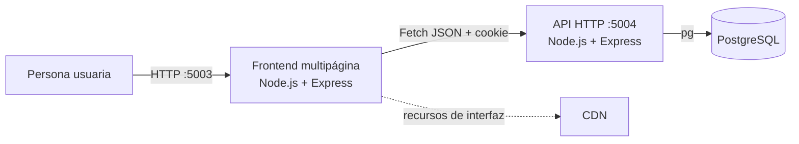

# Gestor de Conformidades de Pago – MDCH

Aplicación web para registrar y seguir expedientes de conformidad de pago entre las unidades orgánicas de la Municipalidad Distrital de Characato (MDCH).

## Información general

| Campo | Detalle |
| --- | --- |
| Nombre | Gestor de Conformidades de Pago – MDCH |
| Sigla oficial | GCP |
| Entidad | Municipalidad Distrital de Characato |
| Descripción | seguimiento web de expedientes de conformidad de pago entre unidades |
| Finalidad | centralizar trazabilidad, plazos, bandejas e indicadores hasta cancelación o pago |
| Versión de paquetes | `1.0.0` |
| Licencia declarada en los paquetes | Apache License 2.0 |
| Titularidad | Municipalidad Distrital de Characato |

## Funcionalidad

El sistema implementa tres experiencias de interfaz:

- **Mesa de partes:** registra un número de expediente, selecciona la unidad de destino, consulta envíos y puede retirar el registro inicial bajo condiciones.
- **Unidad orgánica:** recibe, revierte recepción, deriva, retira una derivación no recibida, cancela o registra el pago; además consulta bandejas e indicadores.
- **Administrador:** consulta el universo de expedientes, el historial, vencimientos, indicadores, pipeline y retrasos por área.

Estas funciones permiten consultar el recorrido de los expedientes, detectar vencimientos o recepciones pendientes, priorizar la atención por área y exportar los resultados.

## Arquitectura



El frontend sirve HTML y JavaScript estático. La API mezcla rutas, lógica y SQL en módulos `src/GET` y `src/POST`. La base posee cinco tablas; las relaciones usadas por el código no están respaldadas por claves foráneas.

## Tecnologías

| Tecnología | Versión | Función |
| --- | --- | --- |
| Node.js | 24.19.0 | runtime de ambos procesos |
| Express | 5.1.0 | API y servidor estático |
| PostgreSQL | dump fuente 17.6 | persistencia relacional |
| pg | 8.16.3 | pool y consultas PostgreSQL |
| bcrypt | 6.0.0 | hash y comparación de contraseñas |
| jsonwebtoken | 9.0.2 | creación y verificación del JWT |
| Joi | 18.0.1 | validación de inicio de sesión y alta de usuarios |
| cookie-parser / cors / dotenv | 1.4.7 / 2.8.5 / 17.2.3 | cookies, CORS y entorno |
| JavaScript, HTML y CSS | sin versión | lógica e interfaz multipágina |
| AdminLTE / Bootstrap | 4.0.0-rc3 / 5.3.6 | layout y componentes |
| DataTables / Chart.js | 2.3.4 / 4.5.1 | tablas, Excel e indicadores |

## Estructura

```text
.
├── back/                       API Node.js
├── front/                      servidor y aplicación web
├── database/
│   ├── schema.sql              estructura de la base de datos
│   ├── seed.example.sql        catálogo ficticio de demostración
│   └── migrations/README.md
├── docs/                       documentación técnica y manuales
├── LICENSE                     Apache License 2.0
├── LICENCIA.txt                aviso de licencia en español
└── README.md
```

## Puesta en marcha de desarrollo

### Requisitos

- Node.js y npm compatibles con módulos ESM y `node --watch`;
- PostgreSQL y `psql`;
- dos terminales;
- navegador moderno;
- una base vacía y credenciales locales sin privilegios administrativos.

### 0. Obtener el repositorio

```powershell
git clone https://github.com/municharacato-admin/Gestor-de-Conformidades-de-Pago---MDCH.git
cd Gestor-de-Conformidades-de-Pago---MDCH
```

### 1. Crear el esquema

```powershell
psql --dbname postgres
```

En esa sesión interactiva:

```sql
CREATE ROLE gestor_owner LOGIN;
CREATE ROLE gestor_app LOGIN;
\password gestor_owner
\password gestor_app
CREATE DATABASE gestor_conformidades OWNER gestor_owner ENCODING 'UTF8';
\q
```

Después, desde la raíz:

```powershell
psql -v ON_ERROR_STOP=1 -U gestor_owner -d gestor_conformidades -f database/schema.sql
psql -v ON_ERROR_STOP=1 -U gestor_owner -d gestor_conformidades -f database/seed.example.sql
psql -v ON_ERROR_STOP=1 -U gestor_owner -d gestor_conformidades -f database/grants.example.sql
```

### 2. Configurar el backend

Antes de copiar, corrija el patrón `//.env` de `back/.gitignore` y compruebe que `git check-ignore -v back/.env` reconoce el archivo. Después copie `back/.env.example` como `back/.env` y sustituya todos los marcadores localmente:

```dotenv
CORS_ORIGIN=http://localhost:5003
DB_HOST=127.0.0.1
DB_PORT=5432
DB_NAME=gestor_conformidades
DB_USER=gestor_app
DB_PASSWORD=REEMPLAZAR_LOCALMENTE
SECRET_JWT_KEY=GENERAR_UN_SECRETO_ALEATORIO_LOCAL
```

`CORS_ORIGIN` está declarada, pero el código actual no la usa.

### 3. Instalar y ejecutar

En una terminal:

```powershell
cd back
npm install
npm run dev
```

En otra:

```powershell
cd front
npm install
npm run dev
```

Antes de abrir `http://localhost:5003`, edite localmente `front/public/assets/js/common/config.js` para que `base_url` apunte al backend y termine en `/`.

La instalación detallada, el aprovisionamiento controlado de usuarios y las comprobaciones están en [Instalación de desarrollo](docs/03-instalacion/instalacion-desarrollo.md).

## Flujo básico

1. Aprovisionar cuentas de prueba de forma local y controlada.
2. Iniciar sesión.
3. Mesa de partes registra un expediente y su unidad inicial.
4. La unidad recibe y puede derivar, cancelar o registrar el pago.
5. Administración consulta estado, vencimiento, indicadores e historial.

## Documentación

- [Índice de documentación](docs/README.md)
- Descripción: [general](docs/01-descripcion-general/descripcion-general.md).
- Arquitectura: [software](docs/02-arquitectura/arquitectura-software.md), [backend](docs/02-arquitectura/arquitectura-backend.md), [frontend](docs/02-arquitectura/arquitectura-frontend.md) y [flujos](docs/02-arquitectura/flujo-informacion.md).
- Instalación: [requisitos](docs/03-instalacion/requisitos.md), [desarrollo](docs/03-instalacion/instalacion-desarrollo.md), [configuración](docs/03-instalacion/configuracion.md), [producción](docs/03-instalacion/despliegue-produccion.md) y [problemas](docs/03-instalacion/solucion-problemas.md).
- Datos: [modelo](docs/04-base-datos/modelo-datos.md), [diccionario](docs/04-base-datos/diccionario-datos.md), [relaciones](docs/04-base-datos/relaciones.md) e [inicialización](docs/04-base-datos/inicializacion.md).
- API: [catálogo](docs/05-api/api.md), [autenticación](docs/05-api/autenticacion.md) y [códigos](docs/05-api/codigos-respuesta.md).
- Desarrollo: [estructura](docs/08-desarrollo/estructura-proyecto.md), [guía](docs/08-desarrollo/guia-desarrollo.md), [convenciones](docs/08-desarrollo/convenciones.md) y [mantenimiento](docs/08-desarrollo/mantenimiento.md).
- Pruebas: [plan de pruebas](docs/10-pruebas/plan-pruebas.md).

## Base de datos

Use únicamente:

- [`database/schema.sql`](database/schema.sql) para crear la estructura;
- [`database/seed.example.sql`](database/seed.example.sql) para datos ficticios;
- [`database/grants.example.sql`](database/grants.example.sql) para el rol local de ejecución;
- [`database/README.md`](database/README.md) para reglas de inicialización y saneamiento.

## Contribución y licencia

- Proceso de contribución: [CONTRIBUTING.md](CONTRIBUTING.md)
- Autoría disponible: [AUTHORS.md](AUTHORS.md)
- Cambios documentados: [CHANGELOG.md](CHANGELOG.md)
- Texto legal: [LICENSE](LICENSE)
- Aviso en español: [LICENCIA.txt](LICENCIA.txt)
- Atribuciones: [NOTICE](NOTICE)
