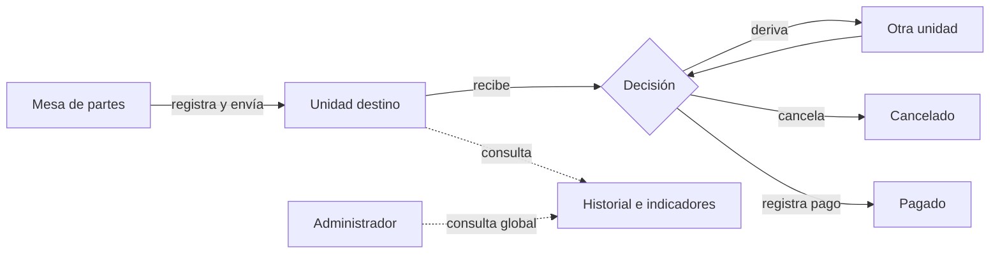

# Descripción general

## Presentación

El **Gestor de Conformidades de Pago – MDCH** es una aplicación web de la Municipalidad Distrital de Characato para registrar y seguir expedientes asociados al proceso de conformidad de pago mientras circulan entre unidades orgánicas.

El repositorio contiene una interfaz multipágina, una API Node.js y un esquema PostgreSQL.

## Problema que aborda

El código busca dar visibilidad a:

- el ingreso de un número de expediente por mesa de partes;
- su unidad de destino;
- fechas de envío y recepción;
- derivaciones posteriores;
- vencimiento general;
- cancelación o pago;
- historial de oficinas;
- expedientes en proceso, retrasados y pendientes de recepción.

La versión actual no integra sistemas contables, trámite documentario, firma digital, notificaciones ni almacenamiento de archivos.

## Objetivo general

Centralizar el registro y seguimiento de expedientes de conformidad de pago, mostrando su situación y recorrido hasta un resultado terminal.

## Objetivos específicos

1. registrar un expediente y calcular su plazo;
2. mantener un historial de movimientos entre unidades;
3. mostrar bandejas de recepción, atención y derivación;
4. registrar cancelación o pago;
5. facilitar consulta global y seguimiento por área;
6. producir indicadores de volumen, estado, retraso y pipeline.

## Alcance funcional

### Mesa de partes

- consulta el catálogo de unidades;
- registra número y destino del expediente;
- visualiza los envíos iniciales;
- elimina un registro inicial si no fue recibido ni tuvo más movimientos;
- exporta la tabla a Excel.

### Unidad orgánica

- consulta pendientes de recepción;
- recibe o revierte la recepción;
- deriva a otra unidad con justificación;
- elimina su última derivación si sigue sin recepción;
- cancela con justificación;
- registra pago desde una condición de interfaz actualmente ligada a un UUID;
- consulta bandejas de recibidos, derivados, cancelados y pagados;
- consulta indicadores e historial;
- exporta tablas a Excel.

### Administración

- consulta todos los expedientes, estado, última oficina y tiempo restante;
- abre el historial cronológico;
- consulta totales y gráficos globales;
- analiza pipeline, retrasos, rendimiento y cuellos de botella por área;
- exporta la tabla global a Excel.

No existe interfaz para administrar usuarios, roles, unidades, parámetros o la configuración del sistema.

## Usuarios y perfiles

El catálogo y el router usan:

| ID | Perfil de interfaz | Propósito |
| --- | --- | --- |
| 1 | Administrador | consulta e indicadores globales |
| 2 | Mesa de partes | registro y envío inicial |
| 3 | Usuario | trabajo de una unidad orgánica |

Estos perfiles no están aplicados como autorización en el backend. Son una organización funcional de la interfaz hasta que se implemente RBAC de servidor.

## Proceso

## Beneficios

- una fuente común de seguimiento;
- trazabilidad de movimientos y recepción;
- detección de expedientes vencidos o sin recibir;
- consulta por perfil y área;
- indicadores para priorización;
- exportación de listados para análisis.

## Limitaciones

- puerto y URL de API codificados;
- dependencia parcial de CDNs;
- ausencia de pruebas automatizadas y lockfiles;
- sin paginación en la API; DataTables pagina localmente después de descargar el listado completo;
- actualizaciones por sondeo de hasta cinco solicitudes por segundo en la vista de usuario;
- cálculo de ocho días que omite feriados;
- métricas con fórmulas no uniformes;
- formatos temporales heterogéneos;
- estados y relaciones no restringidos por la base;

## Funciones no incluidas

No se encuentran implementados:

- gestión de documentos adjuntos;
- firma o visto bueno digital;
- notificaciones por correo/SMS;
- recuperación o cambio de contraseña;
- segundo factor;
- gestión visual de usuarios/roles/unidades;
- auditoría inmutable;
- integración con sistemas externos;
- API versionada;
- aplicación móvil;
- soporte multi-entidad;
- calendario de feriados;
- generación de un comprobante o resolución.

## Estado

Versión `1.0.0`
