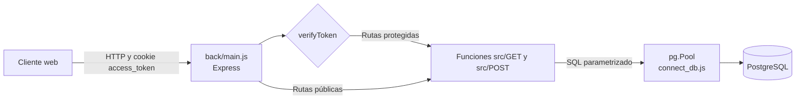

# Arquitectura del backend

> Documentación liberada bajo Apache License 2.0. Consulte LICENSE y LICENCIA.txt.

## Resumen

El backend es una aplicación Node.js con Express 5.1.0 y módulos ECMAScript. Expone directamente 24 endpoints HTTP, valida la cookie JWT con un middleware y ejecuta SQL sobre PostgreSQL mediante un `pg.Pool` global.



No existen `Router` de Express, controladores, servicios ni modelos separados. Los archivos de `src/GET` y `src/POST` combinan consulta SQL, lógica de negocio, formato de datos y manejo de errores.

## Arranque y configuración

| Elemento | Implementación |
| --- | --- |
| Entrada | `back/main.js` |
| Módulos | ESM mediante `"type": "module"` |
| Puerto | `PORT`, con valor predeterminado `5004` |
| Ejecución disponible | `npm start` o `npm run dev` |
| JSON | `express.json()` |
| Cookies | `cookie-parser` |
| CORS | lista exacta de `CORS_ORIGIN`, credenciales habilitadas |
| Base de datos | `pg.Pool` en `back/connect_db.js` |
| Variables | `back/.env.example` |

No hay health check, prefijo `/api`, versionado de API ni manejador global de errores. La configuración de infraestructura de producción corresponde al entorno de despliegue.

## Organización

```text
back/
├── .env.example
├── connect_db.js
├── main.js
├── package.json
└── src/
    ├── GET/             consultas e indicadores
    ├── POST/            altas y cambios de estado
    └── middleware/
        └── jwt_auth.js  validación de cookie JWT
```

### Registro de rutas

`back/main.js` importa cada función y registra los 24 endpoints. Los comentarios los agrupan por perfil, pero esos grupos no constituyen controles de autorización.

- públicos: creación de usuario, login y logout;
- sesión: comprobación de sesión y consulta del rol;
- mesa de partes: catálogos, registro, listado y eliminación inicial;
- unidad orgánica: bandejas, recepción, reversión, derivación, cancelación y pago;
- administración: consulta global, historial e indicadores.

El catálogo detallado se encuentra en [Documentación de la API](../05-api/api.md).

## Acceso a PostgreSQL

`back/connect_db.js` crea un pool con:

- `DB_HOST`;
- `DB_PORT`;
- `DB_USER`;
- `DB_PASSWORD`;
- `DB_NAME`.

No configura TLS, límites de pool, tiempos de espera ni un listener de errores. Casi todas las entradas llegan a SQL mediante parámetros `$1`, `$2`, etc.; no se observó concatenación directa de entradas en las consultas revisadas.

Hay acoplamientos numéricos en el código:

| ID | Uso codificado |
| --- | --- |
| 26 | Mesa de partes y origen del primer movimiento |
| 25 y 26 | Unidades excluidas del catálogo de destinos |
| 8 | Administración en indicadores de pipeline |
| 27 | Tesorería en indicadores |
| 28 | Contabilidad en indicadores |
| 29 | Logística en indicadores |

Los nombres correspondientes dependen de los datos iniciales. La existencia y significado institucional de estos IDs debe confirmarse antes de reutilizar el sistema.

## Operaciones y consistencia

### Registro

`post_publicar_expediente.js`:

1. comprueba el número de expediente;
2. calcula fecha de creación y vencimiento;
3. inserta el maestro con estado `En proceso`;
4. inserta el primer movimiento desde la unidad 26.

El vencimiento suma ocho días de lunes a viernes. No existe calendario de feriados.

### Movimiento

- recibir: completa `historial_expedientes.fecha_recepcion`;
- derivar: crea otro movimiento `En proceso` hacia una unidad;
- revertir recepción: vuelve nula la fecha de recepción bajo condiciones SQL;
- eliminar derivación: borra el último movimiento no recibido de la unidad;
- cancelar o pagar: crea un movimiento terminal auto-dirigido y actualiza el estado maestro.

Los estados persistidos por el código son `En proceso`, `Cancelado` y `Pagado`.

### Transacciones

El registro, la cancelación y el pago constan de varias escrituras sin una transacción común. Un fallo intermedio puede dejar maestro e historial inconsistentes. La eliminación inicial intenta usar `BEGIN`/`COMMIT` mediante `Pool.query`; al no reservar un `PoolClient`, no está garantizado que todas las sentencias usen la misma conexión.

## Autenticación

El login consulta `usuarios`, compara bcrypt y recupera `id_rol`. `main.js` firma un JWT con:

```json
{
  "id": "uuid-del-usuario",
  "rol": [
    { "id_rol": 3 }
  ]
}
```

La forma de `rol` es un arreglo porque `login.js` devuelve `resultado.rows`. La cookie `access_token` es `HttpOnly`, `Secure`, `SameSite=None`, dura 48 horas y se envía en las solicitudes con credenciales.

`verifyToken` verifica firma y expiración y copia el payload a `req.user`. No acepta `Authorization: Bearer`, no comprueba que el usuario siga existiendo y no restringe algoritmo, emisor ni audiencia.


## Autorización

No existe autorización de servidor por rol. Todos los grupos funcionales utilizan únicamente `verifyToken`. Además, recepción, derivación, cancelación y pago no comprueban en el backend que el movimiento pertenezca a la unidad autenticada.

La redirección por rol del frontend es navegación, no una barrera de seguridad.

## Validación y errores

Solo `create_user.js` y `login.js` aplican Joi; exigen strings no vacíos y rechazan propiedades adicionales. No hay límites máximos, `trim`, política de contraseña ni enumeraciones de rol/unidad.

El resto de endpoints consume cuerpos y parámetros sin esquema. Las funciones suelen capturar excepciones y devolver:

```json
{
  "success": false,
  "message": "detalle"
}
```

Las respuestas funcionales de las rutas usan HTTP 200 porque no asignan otro estado; el middleware JWT sí asigna 401 o 403. Express o la infraestructura aún pueden producir 400, 404, 413 o 500 fuera de ese contrato. Algunos mensajes de base de datos pueden propagarse al cliente o a consola.

## Indicadores

Los módulos `get_estadisticas_administrador.js` y `get_estadisticas_usuario.js` ejecutan consultas secuenciales para:

- totales globales y por estado;
- pendientes de recepción;
- actividad diaria;
- conformidades por área;
- KPIs por gerencia, etapas del pipeline, retrasos y cuellos de botella.

No hay paginación del lado servidor ni caché. Los `COUNT` de PostgreSQL suelen serializarse como strings; las conversiones no son uniformes. Algunos helpers devuelven mensajes de error como valores, por lo que una respuesta puede mantener `success: true` con campos inválidos.

## Dependencias

| Paquete | Versión | Uso |
| --- | --- | --- |
| Express | 5.1.0 | servidor y rutas |
| pg | 8.16.3 | pool y consultas PostgreSQL |
| bcrypt | 6.0.0 | hash y comparación de contraseña |
| jsonwebtoken | 9.0.2 | firma y verificación JWT |
| cookie-parser | 1.4.7 | lectura de `access_token` |
| cors | 2.8.5 | cabeceras CORS |
| Joi | 18.2.5 | dos esquemas de validación |
| dotenv | 17.2.3 | carga de `.env` |
