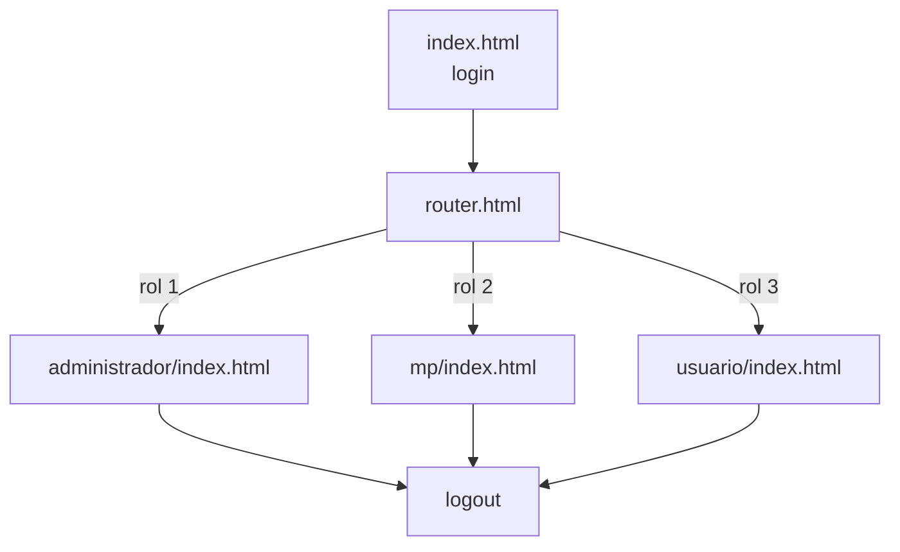

# Arquitectura del frontend

## Tipo de aplicación

El frontend es multipágina, sin framework SPA y sin compilación. `front/main.js` sirve `front/public/` mediante Express en el puerto fijo `5003`.

Debe ejecutarse desde `front/` porque `express.static('public')` resuelve una ruta relativa al directorio actual.

## Estructura

```text
front/
├── main.js
├── package.json
└── public/
    ├── index.html
    └── assets/
        ├── addons/     bibliotecas locales
        ├── css/        estilos propios
        ├── img/
        ├── js/
        │   ├── common/
        │   ├── form_validations/
        │   ├── main/
        │   └── methods/
        └── views/
            ├── router.html
            ├── administrador/
            ├── mp/
            └── usuario/
```

## Configuración

`config.js` contiene:

```javascript
const base_url = "https://example-domain.com/";
```

No existe `.env` de frontend ni inyección en tiempo de ejecución. Para desarrollo debe ajustarse a la API real, normalmente `http://localhost:5004/`. Este cambio manual es una limitación de reproducibilidad y no debe resolverse con dominios institucionales codificados.

## Páginas y navegación



El router usa `data.rol[0].id_rol` numérico. Las páginas finales solo comprueban sesión, no rol; una URL escrita directamente puede cargar otra vista mientras exista una cookie.

## Sesión del cliente

- login con Fetch, JSON y `credentials: include`;
- no almacena JWT en Web Storage;
- guarda el ID devuelto por `check_session` en una variable global;
- `localStorage` se usa solo para tema;
- logout llama la API y vuelve a login.

No hay manejo uniforme de 401 durante sondeos ni `catch` en todos los flujos.

## Módulo administrador

- seis tarjetas: total, pagados, en proceso, retrasados, sin recepción y cancelados;
- gauge de rendimiento;
- distribución por estado;
- actividad diaria;
- barras por gerencia/área;
- tarjetas de pipeline, retraso y cuello de botella;
- tabla global con cuenta regresiva e historial;
- exportación Excel.

No administra usuarios, roles, unidades o parámetros.

## Módulo mesa de partes

- selector buscable de unidad;
- registro de `numero_expediente` y `unidad_organica`;
- tabla de primeros envíos;
- eliminación condicionada por la API;
- exportación Excel;
- recarga cada segundo.

El campo visual de fecha/hora no se valida ni envía y la inicialización de Flatpickr está comentada.

## Módulo usuario

Inicializa cinco tablas y puede consultar cada una por segundo:

| Pestaña | Operaciones |
| --- | --- |
| Por recepcionar | listar y recibir |
| Recepcionados | derivar, revertir recepción, cancelar y registrar pago |
| Derivados | listar y eliminar/retornar el último envío no recibido |
| Cancelados | consultar |
| Pagados | consultar |

## JavaScript, formularios y consumo de API

| Área/archivo propio | Campos o evento | Validación del cliente | Solicitud real |
| --- | --- | --- | --- |
| `form_validations/login.js` y `methods/POST/login.js` | `usuario`, `contrasenia` | JustValidate: no vacíos | `POST /login` con ambos campos |
| `main/mesa_de_partes/main.js` | unidad, número | comprueba valores no vacíos; la fecha visual no se envía | `POST /post_publicar_expediente` con `unidad_organica` y `numero_expediente` |
| `main/usuario/por_recepcionar.js` | botón y ID de fila | sin esquema de formulario | `POST /post_recepcionar_expediente` con `{"id":...}` |
| `main/usuario/recepcionados.js` — derivación | destino, justificación | ambos obligatorios en UI | `POST /post_derivar_expediente` con ID de historial, unidad y justificación |
| mismo archivo — cancelación | justificación | obligatoria en UI | `POST /post_cancelar_expediente` con ID y justificación |
| mismo archivo — pago | clic; UUID fijo | puerta de visibilidad, no autorización | `POST /post_pagar_expediente` con ID; el cliente omite justificación |
| `main/usuario/derivados.js` | botón y ID | sin confirmación robusta | `POST /post_eliminar_expediente_usuario` con `{"id":...}` |

`common/config.js` construye todas las URLs; los módulos GET alimentan DataTables/KPI y los módulos POST muestran avisos. Las páginas usan Fetch con `credentials:"include"`. La mayoría de estas entradas no tiene un esquema equivalente en la API.

## Tablas, gráficos y exportación

DataTables aporta búsqueda, orden, paginación local y exportación `excelHtml5`. Aunque se carga pdfmake, no hay botón PDF configurado.

En el perfil Administrador, Chart.js dibuja:

- rendimiento ponderado;
- distribución de estados;
- actividad diaria;
- conformidades por área.

El perfil Usuario ejecuta el gauge, la distribución y tarjetas por área; importa los módulos de actividad/área pero no los ejecuta. Las tarjetas KPI se construyen como HTML y barras de Bootstrap, no como gráficos Chart.js.

Las fórmulas de rendimiento global y por área no son iguales; en particular, cancelados penalizan una y suman positivamente en otra. La definición institucional del KPI está **PENDIENTE DE CONFIRMACIÓN**.

## Bibliotecas observadas

| Biblioteca | Versión observable | Uso |
| --- | --- | --- |
| Express | 5.1.0 | servidor estático |
| Bootstrap | 5.3.6 | UI |
| AdminLTE | 4.0.0-rc3 | layout |
| jQuery | 3.7.1 | dependencia de widgets |
| Popper | 2.11.8 | posicionamiento |
| Flatpickr | 4.6.13 | incluido; inicialización principal comentada |
| Choices | 11.1.0 | selector de unidades |
| OverlayScrollbars | 2.11.0 | scroll |
| SweetAlert2 | 11.17.2 | avisos/preloader |
| Chart.js | 4.5.1 | gráficos |
| DataTables | 2.3.4 | tablas/exportación |
| JSZip | 3.10.1 | Excel |
| pdfmake | 0.2.7 | cargado, no usado en botones |
| Bootstrap Icons | 1.13.1 | iconografía |
| Source Sans 3 | 5.0.12 | tipografía |

Parte de estos recursos se carga desde CDN y algunas URLs no muestran SRI. La aplicación no es autónoma sin Internet.

## Recomendaciones

1. configuración runtime o build por entorno;
2. autorización exclusivamente en API y capacidades devueltas por servidor;
3. escape/sanitización y APIs DOM seguras;
4. actualización bajo demanda, WebSocket/SSE o sondeo con backoff;
5. cliente HTTP común con manejo de estados/sesión;
6. contrato ISO 8601 y `null`;
7. inventario/licencias y empaquetado reproducible de assets;
8. pruebas de interfaz, accesibilidad y métricas;
9. una única fuente de versión.
