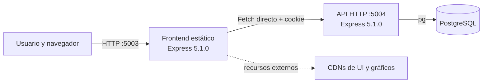
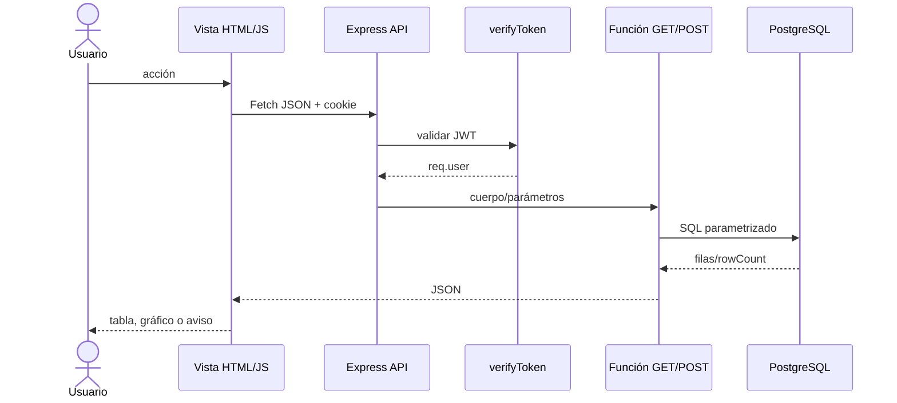
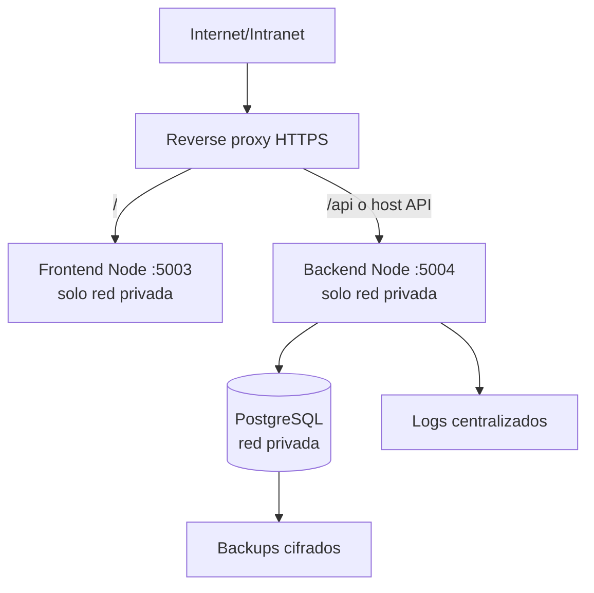
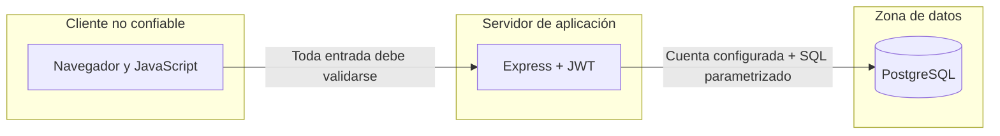

# Arquitectura de software

## Vista general

La implementación es una aplicación web de tres procesos:

El diagrama refleja desarrollo local. El repositorio no incluye reverse proxy, TLS, contenedores, servicio de proceso ni infraestructura como código.

## Componentes

| Componente | Ubicación | Responsabilidad |
| --- | --- | --- |
| Frontend | `front/` | servir HTML/assets, navegación, formularios, tablas y gráficos |
| API | `back/` | autenticación, lógica de expedientes, indicadores y SQL |
| Datos | `database/` | esquema, seed ficticio y respaldo aportado |
| Documentación | `docs/` | manuales y preparación de publicación |

## Capas reales

### Presentación

HTML multipágina y JavaScript nativo. DataTables, Chart.js, AdminLTE, Bootstrap y otras bibliotecas se cargan como globales. El servidor frontend solo ejecuta `express.static`.

### Aplicación/API

`back/main.js` concentra middleware y rutas. Cada función en `src/GET` o `src/POST` implementa caso de uso y SQL; no hay capas separadas de dominio o repositorio.

### Persistencia

`pg.Pool` ejecuta consultas parametrizadas sobre cinco tablas PostgreSQL. Las relaciones son lógicas, porque el esquema no tiene claves foráneas.

## Comunicación frontend-backend

`front/public/assets/js/common/config.js` define una URL absoluta y el navegador llama directamente a la API. No existe proxy del servidor frontend.

Las solicitudes de sesión usan una cookie `HttpOnly` y `credentials: include`. Para separar orígenes se necesita:

- CORS con el origen exacto;
- HTTPS;
- atributos coherentes de cookie;
- protección CSRF.

La versión actual usa `origin: true` y no consume `CORS_ORIGIN`.

## Flujo de solicitud

Las rutas públicas omiten `verifyToken`. Las rutas protegidas no tienen middleware adicional por rol.

## Despliegue lógico recomendado

Es una estrategia recomendada; Nginx, Apache HTTP Server, Caddy, PM2 o systemd no son dependencias actuales.

## Dependencias externas

- PostgreSQL;
- Node.js y npm;
- navegador moderno;
- acceso a CDNs para algunos recursos de interfaz;
- DNS y certificado TLS en producción;
- infraestructura de logs y backup a definir.

No se observaron APIs institucionales externas.

## Disponibilidad y escalabilidad

El backend no mantiene sesión en memoria; el JWT permitiría varias instancias, pero:

- no hay health check ni cierre ordenado;
- no hay caché;
- los indicadores ejecutan varias consultas;
- el frontend realiza sondeo frecuente;
- no hay paginación del lado servidor;
- el pool no tiene límites explícitos.

## Fronteras de confianza

El código acepta el `DB_USER` configurado y no comprueba sus privilegios; aplicar una cuenta mínima es una recomendación, no un control observado. El rol, el UUID de Tesorería y la vista mostrada por el cliente tampoco deben considerarse autorizaciones. La versión actual incumple esta frontera y requiere remediación.