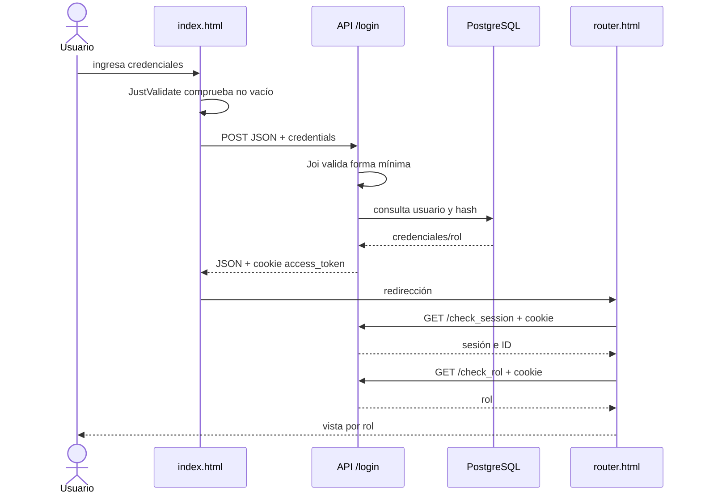
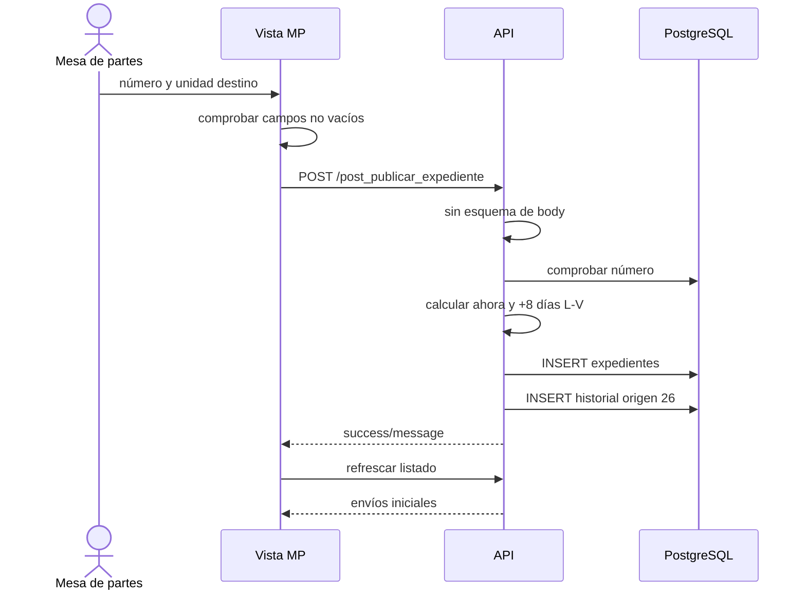
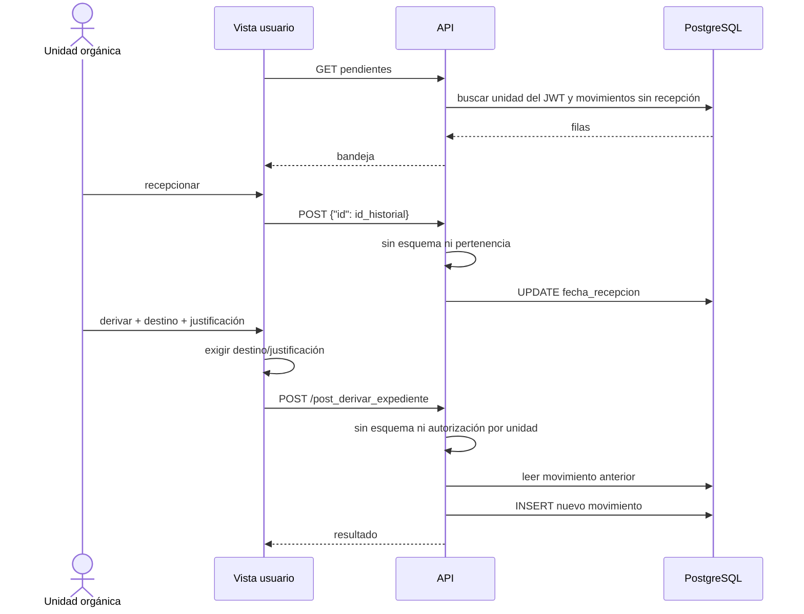
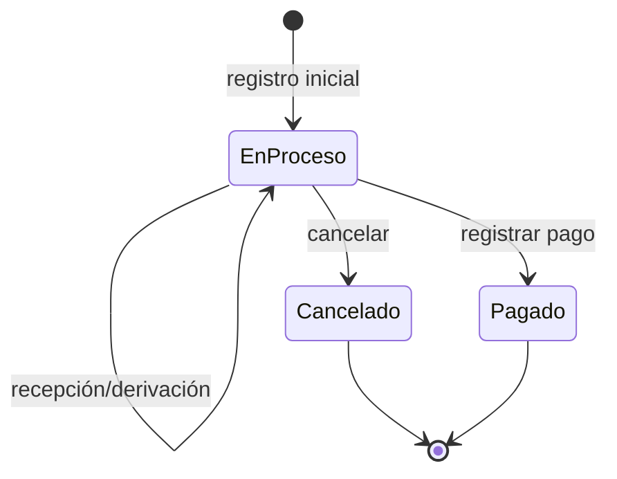
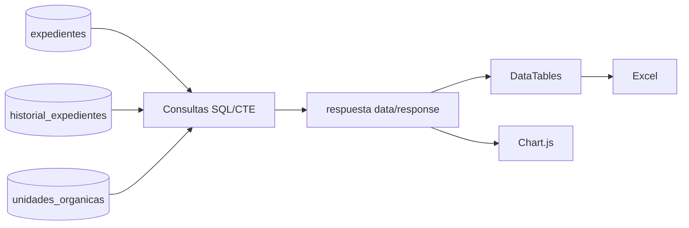

# Flujo de información

> Documentación liberada bajo Apache License 2.0. Consulte LICENSE y LICENCIA.txt.

## Inicio de sesión

## Registro inicial

Las dos inserciones no comparten transacción.

## Atención y derivación

## Validación real

| Flujo | Cliente | API/BD |
| --- | --- | --- |
| login/alta | login comprueba campos no vacíos | Joi valida forma mínima; restricciones únicas en alta |
| registro MP | comprueba unidad y número; fecha ignorada | sin Joi; consulta duplicado no atómica |
| recepción | ID tomado de la fila | sin esquema ni control de pertenencia |
| derivación/cancelación | campos obligatorios en la UI | sin Joi, máquina de estados o pertenencia |
| pago | botón condicionado por UUID | backend no verifica Tesorería, rol o unidad |
| reversión/eliminación | botón por fila | algunas condiciones SQL de unidad/último movimiento |

La palabra «validación» en el flujo no implica defensa en tres capas. El esquema no contiene FKs, CHECK o triggers y el servidor debe validar todo dato del navegador.

## Terminación

La recepción no es un estado de columna; se representa con `fecha_recepcion`. La base no impide transiciones posteriores, duplicadas o inválidas.

## Consultas e indicadores

Los indicadores se calculan bajo demanda. El frontend de usuario actualiza tablas por sondeo, pero no refresca los KPI al mismo ritmo.

## Datos sensibles por frontera

| Flujo | Datos | Tratamiento requerido |
| --- | --- | --- |
| login | usuario y contraseña | HTTPS; nunca loguear contraseña |
| cookie | JWT con UUID y rol | `HttpOnly`, rotación y no capturar |
| API | número, oficinas, fechas, justificación | autorización por unidad/rol |
| BD | hash bcrypt y trazabilidad | privilegios mínimos y backups cifrados |
| exportación | listados | control de acceso y custodia del archivo |
| evidencias | capturas | solo datos ficticios |

## Dependencias ocultas identificadas

- IDs de rol 1–3;
- IDs de unidad 8, 25–29;
- UUID de habilitación de pago en el cliente;
- URL base editada manualmente;
- origen 26 para primer movimiento;
- acceso a Internet para CDNs.
