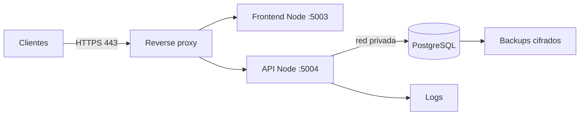

# Despliegue en producción

## Configuración por ambiente

Inyecte `DB_HOST`, `DB_PORT`, `DB_NAME`, `DB_USER`, `DB_PASSWORD` y `SECRET_JWT_KEY` desde el mecanismo de secretos del ambiente. `CORS_ORIGIN` también debe definirse y el código debe corregirse para usarla. No incluya valores en imágenes, unidades de servicio o repositorios. Consulte la [referencia de configuración](configuracion.md).

## Topología propuesta

Nginx, Apache HTTP Server o Caddy para proxy, y systemd o PM2 para proceso, son opciones operativas; no son dependencias del repositorio.

## Preparación

1. aprobar versión/commit y licencia;
2. ejecutar pruebas y revisión de seguridad;
3. construir una base desde migraciones/esquema, nunca desde un dump con datos;
4. inventariar y fijar dependencias;
5. configurar secretos en un almacén;
6. definir dominios, certificado, CORS y cookies;
7. definir logs, alertas, backup y rollback.

## Node.js

- fije una versión LTS probada mediante política institucional;
- use `npm ci` con lockfiles versionados cuando existan;
- ejecute con usuario de sistema sin shell/privilegios innecesarios;
- añada scripts `start` y health/readiness;
- configure reinicio automático y límites;
- implemente manejo de `SIGTERM` para dejar de aceptar tráfico y cerrar el pool.

## Reverse proxy y HTTPS

- exponga solo 443, y 80 únicamente para redirección/validación;
- mantenga 5003/5004 en loopback o red privada;
- renueve certificados automáticamente;
- limite tamaño de cuerpo y timeouts;
- añada cabeceras de seguridad;
- conserve IP/`request_id` de forma segura;
- no registre cookies ni cuerpos de login.

Para simplificar cookies y CORS, puede servir frontend y API bajo el mismo sitio, por ejemplo `/` y `/api/`, pero el código actual necesita adaptar sus rutas/configuración.

## PostgreSQL

- versión soportada y parchada;
- usuario de ejecución sin superusuario;
- migración con rol separado;
- `sslmode` cuando aplique;
- firewall/listen restrictivo;
- timeouts y pool;
- almacenamiento y backups cifrados;
- supervisión de conexiones, espacio y consultas lentas;
- restauración probada.

## Logs y monitoreo

Registrar:

- inicio/parada y versión;
- errores con `request_id`;
- autenticación exitosa/fallida sin credenciales;
- denegaciones de permisos;
- mutaciones con actor/recurso/resultado;
- salud y latencia.

Definir métricas, umbrales y alertas. No existe implementación actual.

## Backup y continuidad

Defina:

- responsable;
- frecuencia y retención;
- RPO/RTO;
- cifrado y custodia;
- copia fuera del host;
- prueba documentada de restauración;
- tratamiento de datos personales;
- borrado seguro.

## Actualización

1. backup verificado;
2. modo mantenimiento o despliegue gradual;
3. migraciones con prechecks;
4. instalar artefacto/commit inmutable;
5. smoke tests;
6. monitoreo reforzado;
7. rollback de aplicación y plan compatible de BD;
8. actualizar changelog/evidencias.

## Firewall mínimo

| Origen | Destino | Puerto |
| --- | --- | --- |
| clientes | reverse proxy | 443 |
| reverse proxy | Node | 5003/5004 privados |
| backend | PostgreSQL | puerto configurado |
| administración | hosts | solo canal de gestión aprobado |

Deniegue el resto por defecto.
