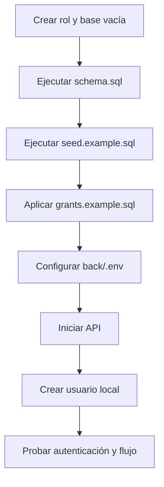

# Inicialización de PostgreSQL

## Procedimiento

1. Instale una versión compatible de PostgreSQL. La fuente comprobada es 17.6.
2. Cree un rol propietario/migrador, un rol de ejecución y una base UTF-8 sin escribir claves en comandos compartidos.
3. Ejecute `database/schema.sql` con `ON_ERROR_STOP`.
4. Ejecute `database/seed.example.sql`.
5. Ejecute `database/grants.example.sql` como propietario.
6. configure `back/.env` con el rol de ejecución.
7. arranque el backend desde `back/`.
8. cree usuarios de demostración mediante el procedimiento local controlado.
9. valide login y un flujo completo con información ficticia.

Los comandos completos están en [database/README.md](../../database/README.md).

## Orden



## Qué no debe cargarse

- `bk-clean.sql`;
- dumps de producción;
- usuarios reales;
- hashes copiados;
- expedientes institucionales;
- nombres o datos personales en evidencias.

## Migraciones

No hay herramienta de migración implementada. La línea base es `schema.sql` y los cambios futuros deben registrarse en `database/migrations/`. La versión de esquema no se almacena aún en la base: **PENDIENTE DE DEFINIR**.

## Comprobaciones

```sql
SELECT current_database(), current_user, version();
SELECT COUNT(*) FROM roles;
SELECT COUNT(*) FROM unidades_organicas;
SELECT COUNT(*) FROM usuarios; -- debe ser 0 justo después del seed
```

No copie el resultado de consultas que incluyan `usuario` o `contrasenia` a tickets o capturas.
