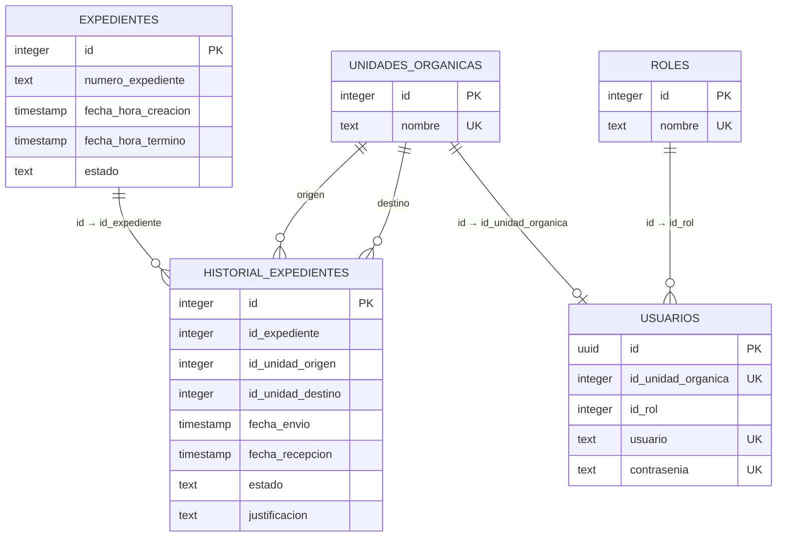

# Modelo de datos

> Documentación liberada bajo Apache License 2.0. Consulte LICENSE y LICENCIA.txt.

## Fuente

El modelo se obtuvo de `database/bk-clean.sql` y se trasladó sin filas a `database/schema.sql`. El volcado declara PostgreSQL 17.6 y contiene cinco tablas, cuatro secuencias, claves primarias y restricciones únicas. No contiene claves foráneas.

## Entidades

- `expedientes`: maestro de cada conformidad/expediente y su plazo general.
- `historial_expedientes`: movimientos del expediente entre unidades y eventos terminales.
- `unidades_organicas`: catálogo de áreas.
- `roles`: catálogo de los tres perfiles.
- `usuarios`: credenciales y asociación con una unidad y un rol.

## Relaciones lógicas

Las líneas del diagrama describen joins usados por el código, no restricciones físicas. La base permite actualmente referencias huérfanas.

## Claves y restricciones

| Tabla | PK | Restricciones adicionales |
| --- | --- | --- |
| expedientes | `id` | ninguna; `numero_expediente` no es único en BD |
| historial_expedientes | `id` | ninguna |
| roles | `id` | `nombre` único |
| unidades_organicas | `id` | `nombre` único |
| usuarios | `id` UUID | unidad, usuario y hash de contraseña únicos |

Las secuencias generan IDs para todas las tablas excepto `usuarios`; la aplicación usa `crypto.randomUUID()`.

## Estados

El código escribe estos valores:

- `En proceso` al crear el maestro y cada derivación;
- `Cancelado` como evento terminal y estado maestro;
- `Pagado` como evento terminal y estado maestro.

La recepción se representa llenando `fecha_recepcion`; no cambia `estado`. «No recepcionado» es, en varias respuestas, una cadena de presentación generada con `COALESCE` y no un estado persistido.

No existen `CHECK` que limiten estados ni una tabla de estados.

## Plazo

`fecha_hora_termino` se calcula al registrar sumando ocho días de lunes a viernes en zona `America/Lima`. El cálculo no consulta feriados. Los indicadores consideran retrasado un expediente `En proceso` cuando `NOW()` supera el término.

Cualquier corrección debe introducirse mediante una migración después de comprobar y limpiar datos existentes.
