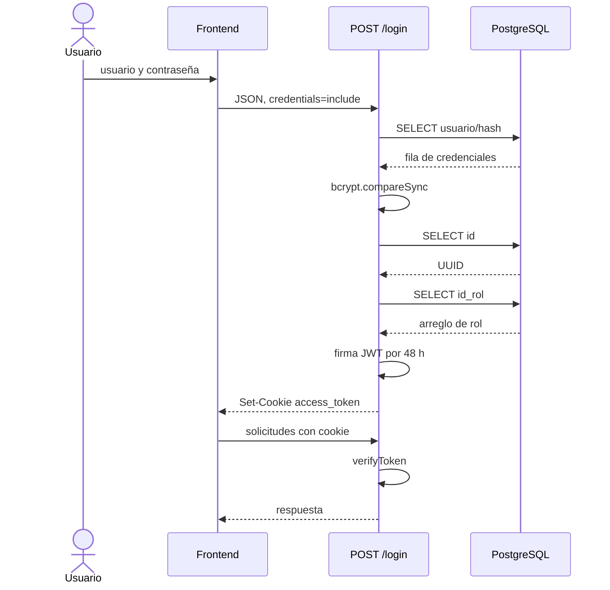

# Autenticación y autorización

## Implementación actual

La versión 1.0.0 utiliza credenciales locales almacenadas en PostgreSQL, bcrypt y un JWT dentro de una cookie.



## Contraseñas

- creación: `bcrypt.hashSync(contrasenia, 10)`;
- login: `bcrypt.compareSync`;
- la API no devuelve el hash;
- Joi solo exige un string de longitud mínima 1;
- no existen longitud máxima, política de complejidad, bloqueo, restablecimiento ni cambio de contraseña.

La restricción `UNIQUE` sobre `usuarios.contrasenia` en el esquema de origen compara hashes salados y no aporta una política útil; debe revisarse.

## JWT

| Propiedad | Valor actual |
| --- | --- |
| Secreto | `SECRET_JWT_KEY` |
| Payload | `id` y `rol` |
| Forma del rol | arreglo `[{"id_rol": n}]` |
| Expiración | 48 horas |
| Algoritmo | valor predeterminado de jsonwebtoken; no se restringe al verificar |
| Emisor/audiencia | no definidos |
| Revocación | no implementada |
| Transporte alternativo | no existe Bearer token |

El middleware copia los claims a `req.user`, pero no consulta si el usuario sigue activo ni si su rol cambió. Una cuenta eliminada o degradada puede seguir usando un JWT existente hasta 48 horas.

## Cookie

```text
Nombre:   access_token
HttpOnly: true
Secure:   true
SameSite: None
Path:     /
Max-Age:  48 horas
```

El frontend usa `credentials: "include"`. `Secure` requiere HTTPS para un despliegue normal. `SameSite=None` permite envío entre sitios y, junto con CORS reflejado, exige una defensa CSRF que no está implementada.

## Cierre de sesión

`POST /logout` borra la cookie con los mismos atributos. No mantiene una lista de revocación; una copia del token continuaría siendo válida hasta expirar.

## Navegación por rol

`router.html` llama `/check_rol` y redirige:

| ID | Vista |
| --- | --- |
| 1 | administrador |
| 2 | mesa de partes |
| 3 | unidad orgánica |

Este mecanismo solo selecciona una pantalla. El backend no aplica la matriz.

## Matriz pretendida y control real

| Capacidad | Perfil pretendido | Control real |
| --- | --- | --- |
| consulta global e indicadores | administrador | cualquier JWT |
| publicar/eliminar primer envío | mesa de partes | cualquier JWT |
| bandejas y movimiento | unidad orgánica | JWT; algunas consultas filtran por unidad |
| crear usuario y escoger rol | aprovisionamiento administrativo | público |

## Respuestas del middleware

| Condición | HTTP | Cuerpo |
| --- | --- | --- |
| cookie ausente | 401 | `success:false`, token no proporcionado |
| token expirado | 401 | `success:false`, sesión expirada |
| token inválido | 403 | `success:false`, token inválido |